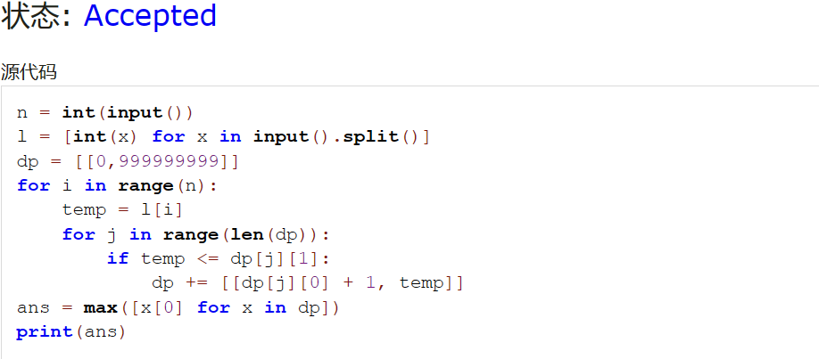
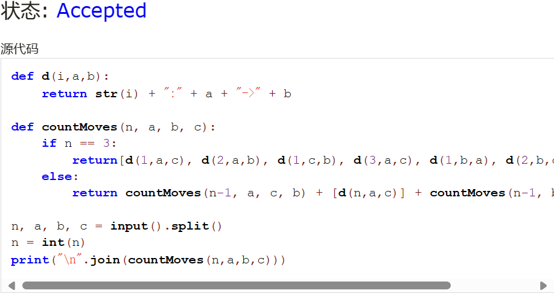
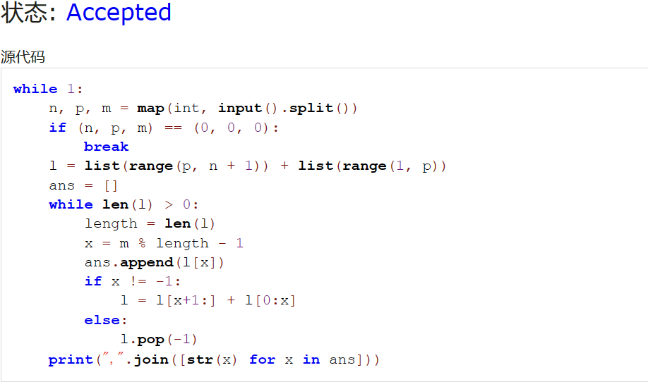
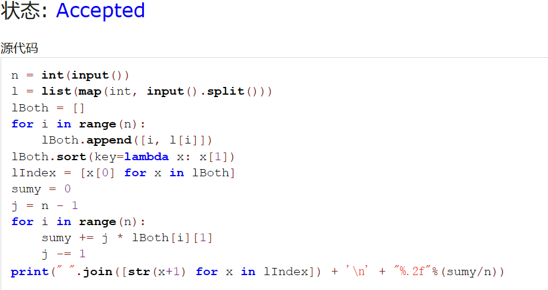
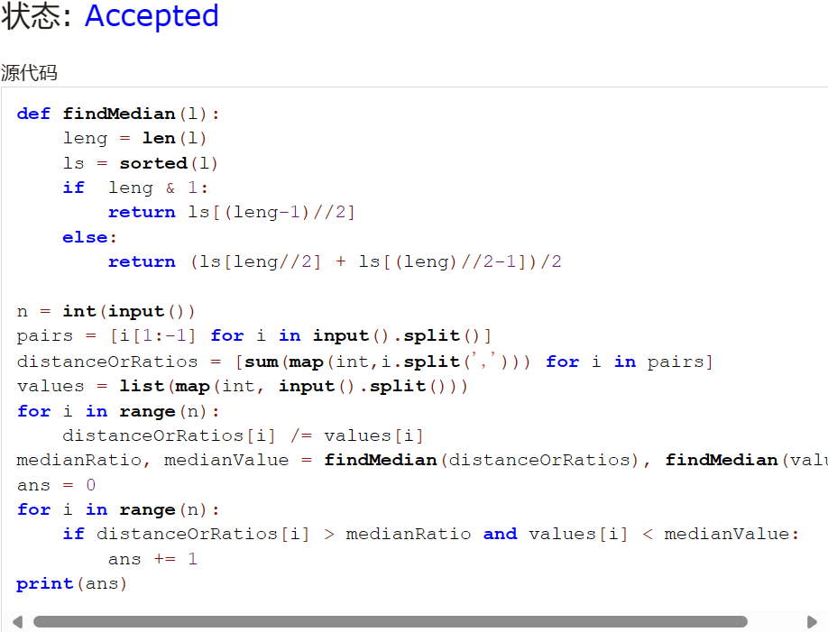
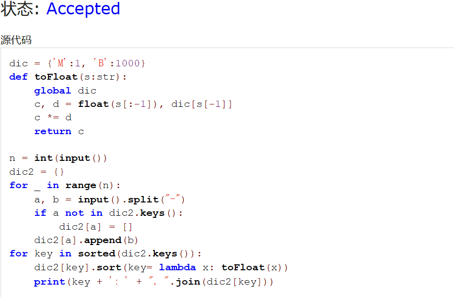

# Assignment #3: March月考

Updated 1537 GMT+8 March 6, 2024

2024 spring, Complied by ~~天幂~~ 化学与分子工程学院


**说明：**

1）The complete process to learn DSA from scratch can be broken into 4 parts:
- Learn about Time and Space complexities
- Learn the basics of individual Data Structures
- Learn the basics of Algorithms
- Practice Problems on DSA

2）请把每个题目解题思路（可选），源码Python, 或者C++（已经在Codeforces/Openjudge上AC），截图（包含Accepted），填写到下面作业模版中（推荐使用 typora https://typoraio.cn ，或者用word）。AC 或者没有AC，都请标上每个题目大致花费时间。

3）提交时候先提交pdf文件，再把md或者doc文件上传到右侧“作业评论”。Canvas需要有同学清晰头像、提交文件有pdf、"作业评论"区有上传的md或者doc附件。

4）如果不能在截止前提交作业，请写明原因。


**编程环境**

操作系统：Windows 11 23H2

Python编程环境：Visual Studio Code 1.86.2


## 1. 题目

**02945: 拦截导弹**

http://cs101.openjudge.cn/practice/02945/


思路：dp，存下当前所有可行方案的拦截数与最后发射高度，最后读取最大值。


##### 代码

```python
n = int(input())
l = [int(x) for x in input().split()]
dp = [[0,999999999]]
for i in range(n):
    temp = l[i]
    for j in range(len(dp)):
        if temp <= dp[j][1]:
            dp += [[dp[j][0] + 1, temp]]
ans = max([x[0] for x in dp])
print(ans)
```


代码运行截图 




**04147:汉诺塔问题(Tower of Hanoi)**

http://cs101.openjudge.cn/practice/04147


思路：根据题目给出的思路写出递归，n=3的情况抄自样例输入。


##### 代码

```python
def d(i,a,b):
    return str(i) + ":" + a + "->" + b

def countMoves(n, a, b, c):
    if n == 3:
        return[d(1,a,c), d(2,a,b), d(1,c,b), d(3,a,c), d(1,b,a), d(2,b,c), d(1,a,c)]
    else:
        return countMoves(n-1, a, c, b) + [d(n,a,c)] + countMoves(n-1, b, a, c)

n, a, b, c = input().split()
n = int(n)
print("\n".join(countMoves(n,a,b,c)))
```


代码运行截图 




**03253: 约瑟夫问题No.2**

http://cs101.openjudge.cn/practice/03253


思路：比较直接的模拟，每次踢人后通过列表切片重新组合达到列表的重新排列，使得报1的同学始终处于列表的第一位，以此来简化计算。


##### 代码

```python
while 1:
    n, p, m = map(int, input().split())
    if (n, p, m) == (0, 0, 0):
        break
    l = list(range(p, n + 1)) + list(range(1, p))
    ans = []
    while len(l) > 0:
        length = len(l)
        x = m % length - 1
        ans.append(l[x])
        if x != -1:
            l = l[x+1:] + l[0:x]
        else:
            l.pop(-1)
    print(",".join([str(x) for x in ans]))
```


代码运行截图 




**21554:排队做实验 (greedy)v0.2**

http://cs101.openjudge.cn/practice/21554


思路：让做的最快的同学先做完，减少等待总时。处理输入数据的方法有点野蛮，不过能过。


##### 代码

```python
n = int(input())
l = list(map(int, input().split()))
lBoth = []
for i in range(n):
    lBoth.append([i, l[i]])
lBoth.sort(key=lambda x: x[1])
lIndex = [x[0] for x in lBoth]
sumy = 0
j = n - 1
for i in range(n):
    sumy += j * lBoth[i][1]
    j -= 1
print(" ".join([str(x+1) for x in lIndex]) + '\n' + "%.2f"%(sumy/n))
```


代码运行截图 




**19963:买学区房**

http://cs101.openjudge.cn/practice/19963


思路：感觉挺直白的，为了方便，使用两个列表分别储存性价比与价格，排序在函数中完成，以保证索引一致。不过为什么离学校越远性价比越高……


##### 代码

```python
def findMedian(l):
    leng = len(l)
    ls = sorted(l)
    if  leng & 1:
        return ls[(leng-1)//2]
    else:
        return (ls[leng//2] + ls[(leng)//2-1])/2

n = int(input())
pairs = [i[1:-1] for i in input().split()]
distanceOrRatios = [sum(map(int,i.split(','))) for i in pairs]
values = list(map(int, input().split()))
for i in range(n):
    distanceOrRatios[i] /= values[i]
medianRatio, medianValue = findMedian(distanceOrRatios), findMedian(values)
ans = 0
for i in range(n):
    if distanceOrRatios[i] > medianRatio and values[i] < medianValue:
        ans += 1
print(ans)
```


代码运行截图 




**27300: 模型整理**

http://cs101.openjudge.cn/practice/27300


思路：使用模型名称作为键，大小的列表作为值，使用函数计算大小自定义排序。


##### 代码

```python
dic = {'M':1, 'B':1000}
def toFloat(s:str):
    global dic
    c, d = float(s[:-1]), dic[s[-1]]
    c *= d
    return c

n = int(input())
dic2 = {}
for _ in range(n):
    a, b = input().split("-")
    if a not in dic2.keys():
        dic2[a] = []
    dic2[a].append(b)
for key in sorted(dic2.keys()):
    dic2[key].sort(key= lambda x: toFloat(x))
    print(key + ': ' + ", ".join(dic2[key]))
```


代码运行截图 




## 2. 学习总结和收获

月考AC5，约瑟夫差一点完成。感觉还是不够熟练，需要多加练习。这几周比较忙，争取下周多练点。


