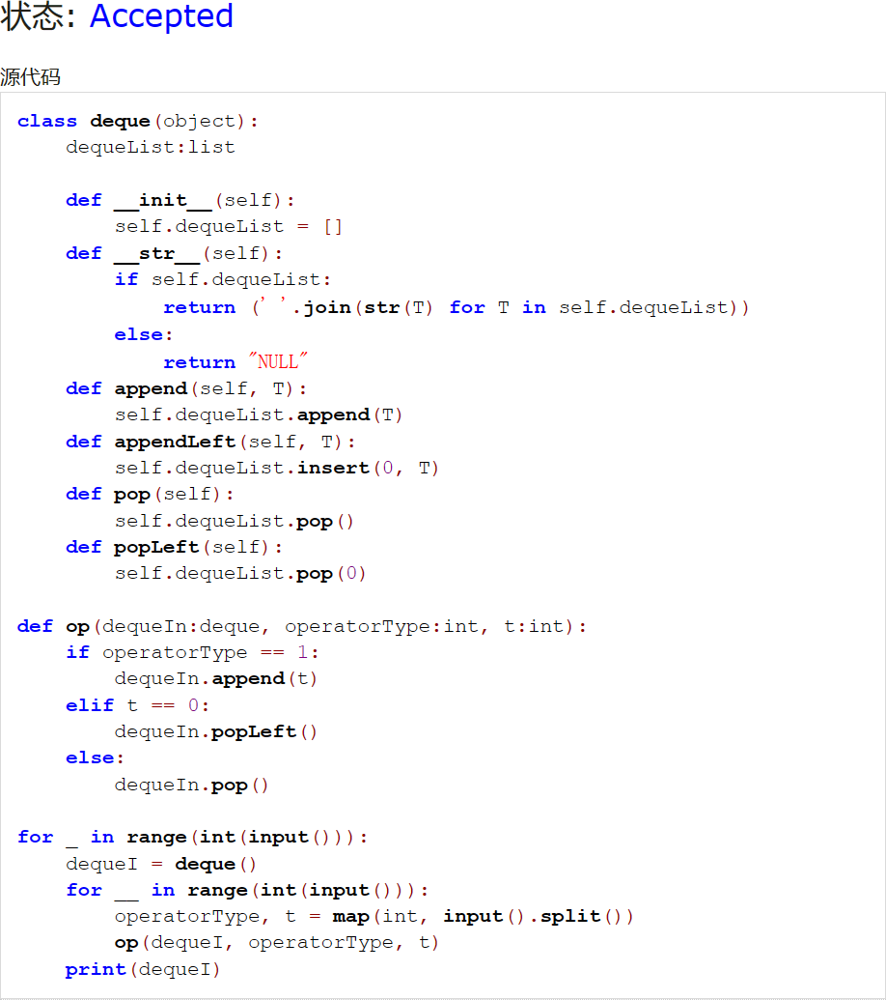
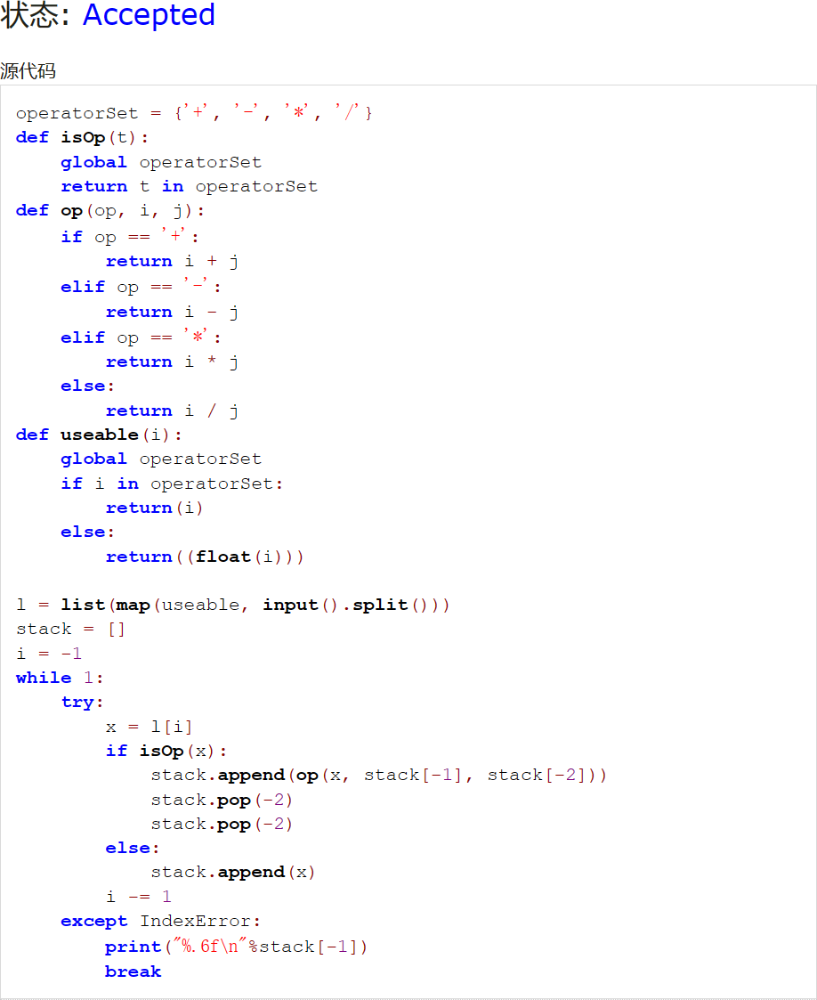
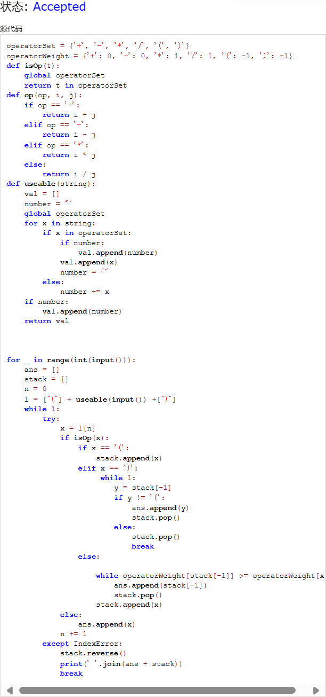
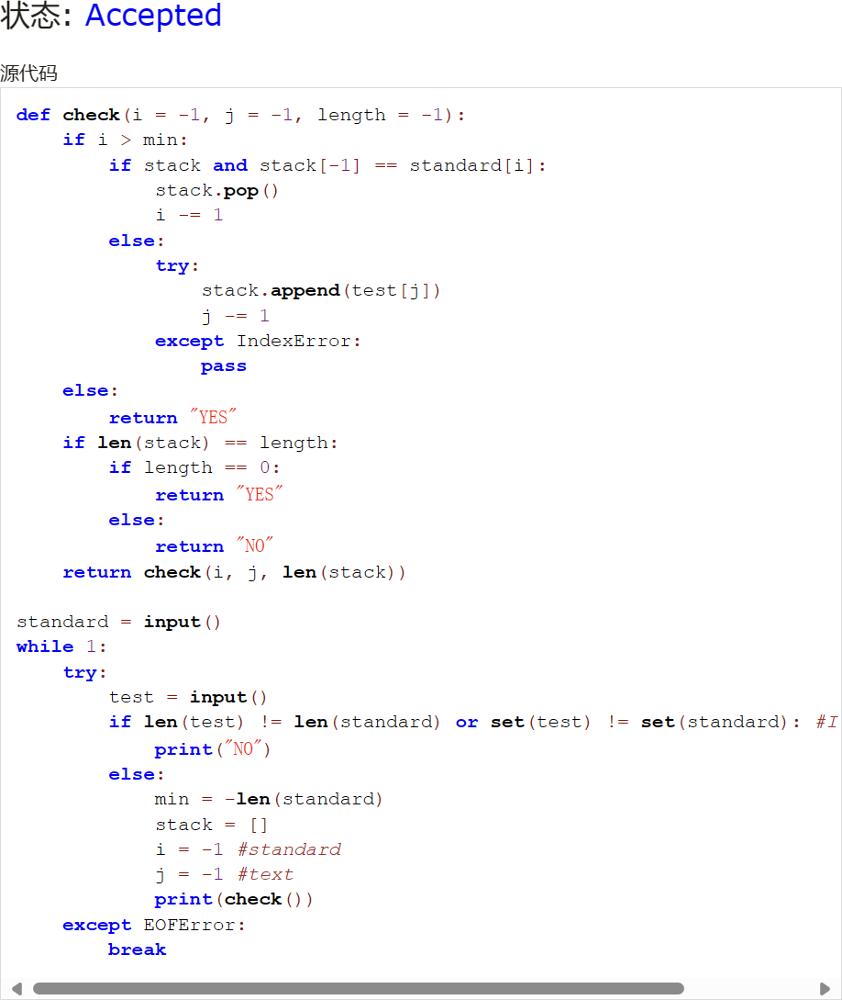
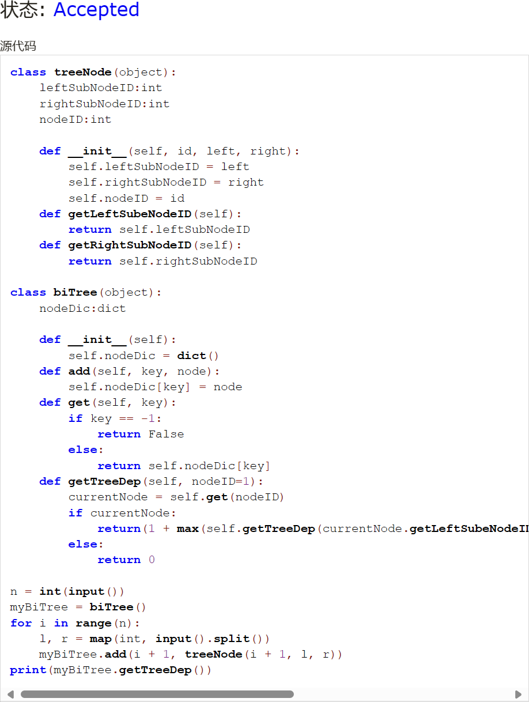
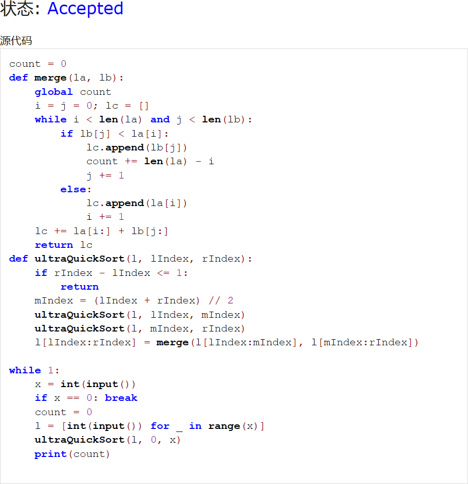

# Assignment #4: 排序、栈、队列和树

Updated 0005 GMT+8 March 11, 2024

2024 spring, Complied by ~~天幂~~ 化学与分子工程学院


**说明：**

1）The complete process to learn DSA from scratch can be broken into 4 parts:

Learn about Time complexities, learn the basics of individual Data Structures, learn the basics of Algorithms, and practice Problems.

2）请把每个题目解题思路（可选），源码Python, 或者C++（已经在Codeforces/Openjudge上AC），截图（包含Accepted），填写到下面作业模版中（推荐使用 typora https://typoraio.cn ，或者用word）。AC 或者没有AC，都请标上每个题目大致花费时间。

3）提交时候先提交pdf文件，再把md或者doc文件上传到右侧“作业评论”。Canvas需要有同学清晰头像、提交文件有pdf、"作业评论"区有上传的md或者doc附件。

4）如果不能在截止前提交作业，请写明原因。


**编程环境**

操作系统：Windows 11 23H2

Python编程环境：Visual Studio Code 1.86.2


## 1. 题目

### 05902: 双端队列

http://cs101.openjudge.cn/practice/05902/


思路：利用pop(0)删除左侧元素，思路简单。


代码

```python
class deque(object):
    dequeList:list
    
    def __init__(self):
        self.dequeList = []
    def __str__(self):
        if self.dequeList:
            return (' '.join(str(T) for T in self.dequeList))
        else:
            return "NULL"
    def append(self, T):
        self.dequeList.append(T)
    def appendLeft(self, T):
        self.dequeList.insert(0, T)
    def pop(self):
        self.dequeList.pop()
    def popLeft(self):
        self.dequeList.pop(0)

def op(dequeIn:deque, operatorType:int, t:int):
    if operatorType == 1:
        dequeIn.append(t)
    elif t == 0:
        dequeIn.popLeft()
    else:
        dequeIn.pop()
  
for _ in range(int(input())):
    dequeI = deque()
    for __ in range(int(input())):
        operatorType, t = map(int, input().split())
        op(dequeI, operatorType, t)
    print(dequeI)
```


代码运行截图 




### 02694: 波兰表达式

http://cs101.openjudge.cn/practice/02694/


思路：反向读取，将数字入栈，遇到符号就计算并去掉用于计算的数字，最后在读完（IndexError）时输出最终结果。


代码

```python
operatorSet = {'+', '-', '*', '/'}
def isOp(t):
    global operatorSet
    return t in operatorSet
def op(op, i, j):
    if op == '+':
        return i + j
    elif op == '-':
        return i - j
    elif op == '*':
        return i * j
    else:
        return i / j
def useable(i):
    global operatorSet
    if i in operatorSet:
        return(i)
    else:
        return((float(i)))

l = list(map(useable, input().split()))
stack = []
i = -1
while 1:
    try:
        x = l[i]
        if isOp(x):
            stack.append(op(x, stack[-1], stack[-2]))
            stack.pop(-2)
            stack.pop(-2)
        else:
            stack.append(x)
        i -= 1
    except IndexError:
        print("%.6f\n"%stack[-1])
        break
```


代码运行截图 




### 24591: 中序表达式转后序表达式

http://cs101.openjudge.cn/practice/24591/


思路：这道题想了挺久的，最初的代码是通过另一个用于标识括号层数的stack实现的，原理上也没问题但是最后结果是同个括号里计算顺序会变倒序。原理上和波兰表达式类似，只是因为几乎是反方向进行，所以需要考虑的边界情况比较多，多考虑一些边界情况思路就会清晰一些。


代码

```python
operatorSet = {'+', '-', '*', '/', '(', ')'}
operatorWeight = {'+': 0, '-': 0, '*': 1, '/': 1, '(': -1, ')': -1}
def isOp(t):
    global operatorSet
    return t in operatorSet
def op(op, i, j):
    if op == '+':
        return i + j
    elif op == '-':
        return i - j
    elif op == '*':
        return i * j
    else:
        return i / j
def useable(string):
    val = []
    number = ""
    global operatorSet
    for x in string:
        if x in operatorSet:
            if number:
                val.append(number)
            val.append(x)
            number = ""
        else:
            number += x
    if number:
        val.append(number)
    return val

for _ in range(int(input())):
    ans = []
    stack = []
    n = 0
    l = ["("] + useable(input()) +[")"]
    while 1:
        try:
            x = l[n]
            if isOp(x):
                if x == '(':
                    stack.append(x)
                elif x == ')':
                     while 1:
                        y = stack[-1]
                        if y != '(':
                            ans.append(y)
                            stack.pop()
                        else:
                            stack.pop()
                            break
                else:
                    
                    while operatorWeight[stack[-1]] >= operatorWeight[x]:
                        ans.append(stack[-1])
                        stack.pop()
                    stack.append(x)
            else:
                ans.append(x)
            n += 1
        except IndexError:
            stack.reverse()
            print(' '.join(ans + stack))
            break
```


代码运行截图 




### 22068: 合法出栈序列

http://cs101.openjudge.cn/practice/22068/


思路：思路其实很直接，倒过来模拟stack的push()和pop()操作，观察最终是否能够清空stack，做的时候感觉最麻烦的一点是最终判断递归是否结束，调试了好久。


代码

```python
def check(i = -1, j = -1, length = -1):
    if i > min:
        if stack and stack[-1] == standard[i]:
            stack.pop()
            i -= 1
        else:
            try:
                stack.append(test[j])
                j -= 1
            except IndexError:
                pass       
    else:
        return "YES" 
    if len(stack) == length:
        if length == 0:
            return "YES"
        else:
            return "NO"
    return check(i, j, len(stack))

standard = input()
while 1:
    try:
        test = input()
        if len(test) != len(standard) or set(test) != set(standard): #I hate this...
            print("NO")
        else:
            min = -len(standard)
            stack = []
            i = -1 #standard
            j = -1 #text
            print(check())
    except EOFError:
        break
```


代码运行截图 




### 06646: 二叉树的深度

http://cs101.openjudge.cn/practice/06646/


思路：定义树节点（包含属性：nodeID与两个子节点的nodeID）与树（有一个用于存所有节点，以nodeID为键的dict()），并通过递归得到树的高度。


代码

```python
class treeNode(object):
    leftSubNodeID:int
    rightSubNodeID:int
    nodeID:int
    
    def __init__(self, id, left, right):
        self.leftSubNodeID = left
        self.rightSubNodeID = right
        self.nodeID = id
    def getLeftSubeNodeID(self):
        return self.leftSubNodeID
    def getRightSubNodeID(self):
        return self.rightSubNodeID

class biTree(object):
    nodeDic:dict
    
    def __init__(self):
        self.nodeDic = dict()
    def add(self, key, node):
        self.nodeDic[key] = node
    def get(self, key):
        if key == -1:
            return False
        else:
            return self.nodeDic[key]
    def getTreeDep(self, nodeID=1):
        currentNode = self.get(nodeID)
        if currentNode:
            return(1 + max(self.getTreeDep(currentNode.getLeftSubeNodeID()), self.getTreeDep(currentNode.getRightSubNodeID())))
        else:
            return 0    
    
n = int(input())
myBiTree = biTree()
for i in range(n):
    l, r = map(int, input().split())
    myBiTree.add(i + 1, treeNode(i + 1, l, r))
print(myBiTree.getTreeDep())
```


代码运行截图 




### 02299: Ultra-QuickSort

http://cs101.openjudge.cn/practice/02299/


思路：使用归并排序兼求逆序数。


代码

```python
count = 0
def merge(la, lb):
    global count
    i = j = 0; lc = []
    while i < len(la) and j < len(lb):
        if lb[j] < la[i]:
            lc.append(lb[j])
            count += len(la) - i
            j += 1
        else:
            lc.append(la[i])
            i += 1
    lc += la[i:] + lb[j:]
    return lc
def ultraQuickSort(l, lIndex, rIndex):
    if rIndex - lIndex <= 1:
        return
    mIndex = (lIndex + rIndex) // 2
    ultraQuickSort(l, lIndex, mIndex)
    ultraQuickSort(l, mIndex, rIndex)
    l[lIndex:rIndex] = merge(l[lIndex:mIndex], l[mIndex:rIndex])

while 1:
    x = int(input())
    if x == 0: break
    count = 0
    l = [int(input()) for _ in range(x)]
    ultraQuickSort(l, 0, x)
    print(count)
```


代码运行截图




## 2. 学习总结和收获

这周题目确实比较难，花了很多时间学习相关概念，下周应该找一些题练习一下。主要是栈和排序，感觉和计概内容确实有很大不同。


