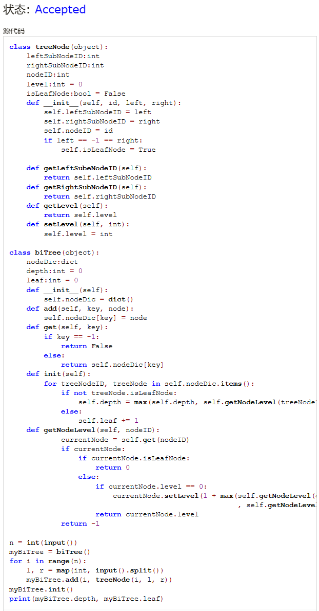
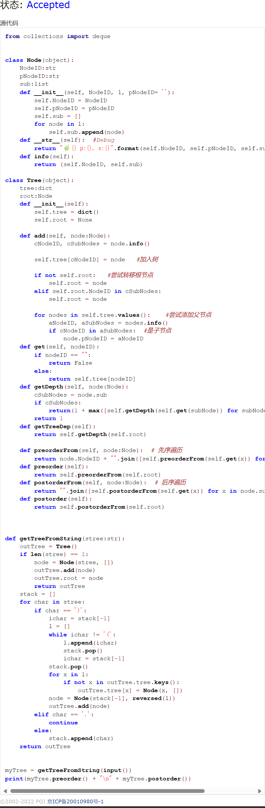
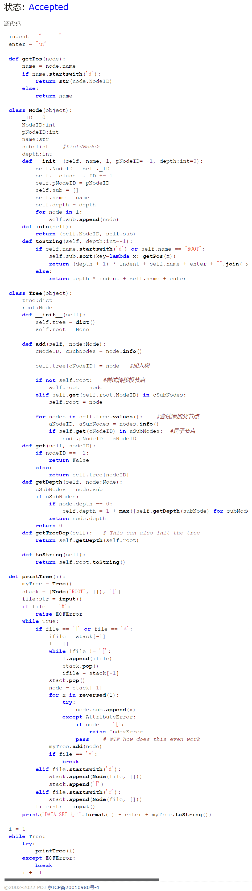
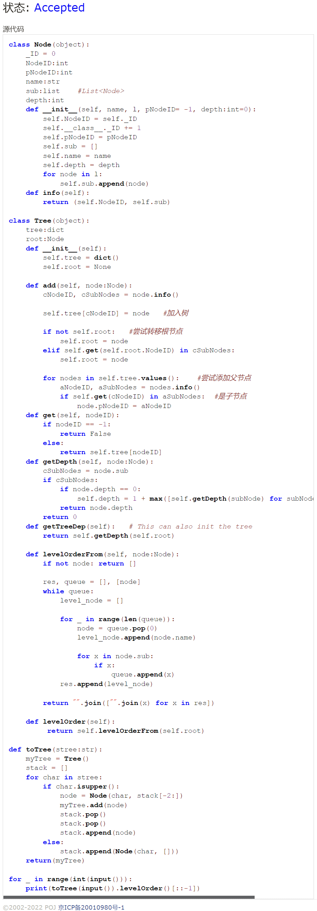
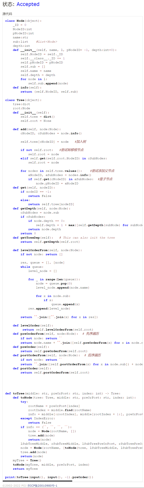
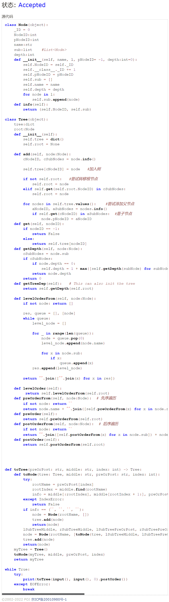

# Assignment #5: "树"算：概念、表示、解析、遍历

Updated 2124 GMT+8 March 17, 2024

2024 spring, Complied by ~~天幂~~ 化学与分子工程学院


**说明：**

1）The complete process to learn DSA from scratch can be broken into 4 parts:

Learn about Time complexities, learn the basics of individual Data Structures, learn the basics of Algorithms, and practice Problems.

2）请把每个题目解题思路（可选），源码Python, 或者C++（已经在Codeforces/Openjudge上AC），截图（包含Accepted），填写到下面作业模版中（推荐使用 typora https://typoraio.cn ，或者用word）。AC 或者没有AC，都请标上每个题目大致花费时间。

3）提交时候先提交pdf文件，再把md或者doc文件上传到右侧“作业评论”。Canvas需要有同学清晰头像、提交文件有pdf、"作业评论"区有上传的md或者doc附件。

4）如果不能在截止前提交作业，请写明原因。


**编程环境**

操作系统：Windows 11 23H2

Python编程环境：Visual Studio Code 1.86.2230.


## 1. 题目

### 27638: 求二叉树的高度和叶子数目

http://cs101.openjudge.cn/practice/27638/


思路：使用init()完成树的构建，一次性得到深度和叶数。感觉有点臃肿。


代码

```python
class treeNode(object):
    leftSubNodeID:int
    rightSubNodeID:int
    nodeID:int
    level:int = 0
    isLeafNode:bool = False
    def __init__(self, id, left, right):
        self.leftSubNodeID = left
        self.rightSubNodeID = right
        self.nodeID = id
        if left == -1 == right:
            self.isLeafNode = True
            
    def getLeftSubeNodeID(self):
        return self.leftSubNodeID
    def getRightSubNodeID(self):
        return self.rightSubNodeID
    def getLevel(self):
        return self.level
    def setLevel(self, int):
        self.level = int

class biTree(object):
    nodeDic:dict
    depth:int = 0
    leaf:int = 0
    def __init__(self):
        self.nodeDic = dict()
    def add(self, key, node):
        self.nodeDic[key] = node
    def get(self, key):
        if key == -1:
            return False
        else:
            return self.nodeDic[key]
    def init(self):
        for treeNodeID, treeNode in self.nodeDic.items():
            if not treeNode.isLeafNode:
                self.depth = max(self.depth, self.getNodeLevel(treeNodeID))
            else:
                self.leaf += 1
    def getNodeLevel(self, nodeID):
            currentNode = self.get(nodeID)
            if currentNode:
                if currentNode.isLeafNode:
                    return 0
                else:
                    if currentNode.level == 0:
                        currentNode.setLevel(1 + max(self.getNodeLevel(currentNode.getLeftSubeNodeID()), self.getNodeLevel(currentNode.getRightSubNodeID())))
                    return currentNode.level
            return -1
        
n = int(input())
myBiTree = biTree()
for i in range(n):
    l, r = map(int, input().split())
    myBiTree.add(i, treeNode(i, l, r))
myBiTree.init()
print(myBiTree.depth, myBiTree.leaf)
```


代码运行截图 




### 24729: 括号嵌套树

http://cs101.openjudge.cn/practice/24729/


思路：种树用栈，输出用递归。唉，数算。

思路和之前的栈或树相比其实差不多，就是写起来比较费时间。


代码

```python
from collections import deque


class Node(object):
    NodeID:str
    pNodeID:str
    sub:list
    def __init__(self, NodeID, l, pNodeID= ''):
        self.NodeID = NodeID
        self.pNodeID = pNodeID
        self.sub = []
        for node in l:
            self.sub.append(node)
    def __str__(self):  #Debug
        return "🌿{} p:{}, s:{}".format(self.NodeID, self.pNodeID, self.sub)
    def info(self):
        return (self.NodeID, self.sub)
    
class Tree(object):
    tree:dict
    root:Node
    def __init__(self):
        self.tree = dict()
        self.root = None
    
    def add(self, node:Node):
        cNodeID, cSubNodes = node.info()
        
        self.tree[cNodeID] = node   #加入树
        
        if not self.root:   #尝试转移根节点
            self.root = node
        elif self.root.NodeID in cSubNodes:
            self.root = node
            
        for nodes in self.tree.values():    #尝试添加父节点
            aNodeID, aSubNodes = nodes.info()
            if cNodeID in aSubNodes:  #是子节点
                node.pNodeID = aNodeID
    def get(self, nodeID):
        if nodeID == "":
            return False
        else:
            return self.tree[nodeID]
    def getDepth(self, node:Node):
        cSubNodes = node.sub
        if cSubNodes:
            return(1 + max([self.getDepth(self.get(subNode)) for subNode in cSubNodes]))
        return 1  
    def getTreeDep(self):
        return self.getDepth(self.root)
    
    def preorderFrom(self, node:Node):  # 先序遍历
        return node.NodeID + "".join([self.preorderFrom(self.get(x)) for x in node.sub])
    def preorder(self):
        return self.preorderFrom(self.root)
    def postorderFrom(self, node:Node):  # 后序遍历
        return "".join([self.postorderFrom(self.get(x)) for x in node.sub]) + node.NodeID
    def postorder(self):
        return self.postorderFrom(self.root)
    
   
    
def getTreeFromString(stree:str):
    outTree = Tree()
    if len(stree) == 1:
        node = Node(stree, [])
        outTree.add(node)
        outTree.root = node
        return outTree
    stack = []
    for char in stree:
        if char == ')':
            ichar = stack[-1]
            l = []
            while ichar != '(':
                l.append(ichar)
                stack.pop()
                ichar = stack[-1]
            stack.pop()
            for x in l:
                if not x in outTree.tree.keys():
                    outTree.tree[x] = Node(x, [])
            node = Node(stack[-1], reversed(l))
            outTree.add(node)
        elif char == ',':
            continue
        else:
            stack.append(char)
    return outTree


myTree = getTreeFromString(input())
print(myTree.preorder() + "\n" + myTree.postorder())
```


代码运行截图 




### 02775: 文件结构“图”

http://cs101.openjudge.cn/practice/02775/


思路：写了半天发现名字可以重复……看来确实要好好审题。递归+树+栈，还是一个套路。


代码

```python
indent = "|     "
enter = "\n"

def getPos(node):
    name = node.name
    if name.startswith('d'):
        return str(node.NodeID)
    else:
        return name

class Node(object):
    _ID = 0
    NodeID:int
    pNodeID:int
    name:str
    sub:list    #List<Node>
    depth:int
    def __init__(self, name, l, pNodeID= -1, depth:int=0):
        self.NodeID = self._ID
        self.__class__._ID += 1
        self.pNodeID = pNodeID
        self.sub = []
        self.name = name
        self.depth = depth
        for node in l:
            self.sub.append(node)
    def info(self):
        return (self.NodeID, self.sub)
    def toString(self, depth:int=-1):
        if self.name.startswith('d') or self.name == "ROOT":
            self.sub.sort(key=lambda x: getPos(x))
            return (depth + 1) * indent + self.name + enter + "".join([x.toString(depth + 1) for x in self.sub])
        else:
            return depth * indent + self.name + enter

class Tree(object):
    tree:dict
    root:Node
    def __init__(self):
        self.tree = dict()
        self.root = None
    
    def add(self, node:Node):
        cNodeID, cSubNodes = node.info()
        
        self.tree[cNodeID] = node   #加入树
        
        if not self.root:   #尝试转移根节点
            self.root = node
        elif self.get(self.root.NodeID) in cSubNodes:
            self.root = node
            
        for nodes in self.tree.values():    #尝试添加父节点
            aNodeID, aSubNodes = nodes.info()
            if self.get(cNodeID) in aSubNodes:  #是子节点
                node.pNodeID = aNodeID
    def get(self, nodeID):
        if nodeID == -1:
            return False
        else:
            return self.tree[nodeID]
    def getDepth(self, node:Node):
        cSubNodes = node.sub
        if cSubNodes:
            if node.depth == 0:
                self.depth = 1 + max([self.getDepth(subNode) for subNode in cSubNodes])
            return node.depth
        return 0  
    def getTreeDep(self):   # This can also init the tree
        return self.getDepth(self.root)
    
    def toString(self):
        return self.root.toString()

def printTree(i):
    myTree = Tree()
    stack = [Node("ROOT", []), '[']
    file:str = input()
    if file == '#':
        raise EOFError
    while True:
        if file == ']' or file == '*':
            ifile = stack[-1]
            l = []
            while ifile != '[':
                l.append(ifile)
                stack.pop()
                ifile = stack[-1]
            stack.pop()
            node = stack[-1]
            for x in reversed(l):
                try:
                    node.sub.append(x)
                except AttributeError:
                    pass    # WTF how does this even work
            myTree.add(node)
            if file == '*':
                break
        elif file.startswith('d'):
            stack.append(Node(file, []))
            stack.append('[')
        elif file.startswith('f'):
            stack.append(Node(file, []))
        file:str = input()
    print("DATA SET {}:".format(i) + enter + myTree.toString())

i = 1
while True:
    try:
        printTree(i)
    except EOFError:
        break
    i += 1
```


代码运行截图 




### 25140: 根据后序表达式建立队列表达式

http://cs101.openjudge.cn/practice/25140/


思路：和上面基本没变化的栈+树。代码复用率极高。


代码

```python
class Node(object):
    _ID = 0
    NodeID:int
    pNodeID:int
    name:str
    sub:list    #List<Node>
    depth:int
    def __init__(self, name, l, pNodeID= -1, depth:int=0):
        self.NodeID = self._ID
        self.__class__._ID += 1
        self.pNodeID = pNodeID
        self.sub = []
        self.name = name
        self.depth = depth
        for node in l:
            self.sub.append(node)
    def info(self):
        return (self.NodeID, self.sub)

class Tree(object):
    tree:dict
    root:Node
    def __init__(self):
        self.tree = dict()
        self.root = None
    
    def add(self, node:Node):
        cNodeID, cSubNodes = node.info()
        
        self.tree[cNodeID] = node   #加入树
        
        if not self.root:   #尝试转移根节点
            self.root = node
        elif self.get(self.root.NodeID) in cSubNodes:
            self.root = node
            
        for nodes in self.tree.values():    #尝试添加父节点
            aNodeID, aSubNodes = nodes.info()
            if self.get(cNodeID) in aSubNodes:  #是子节点
                node.pNodeID = aNodeID
    def get(self, nodeID):
        if nodeID == -1:
            return False
        else:
            return self.tree[nodeID]
    def getDepth(self, node:Node):
        cSubNodes = node.sub
        if cSubNodes:
            if node.depth == 0:
                self.depth = 1 + max([self.getDepth(subNode) for subNode in cSubNodes])
            return node.depth
        return 0  
    def getTreeDep(self):   # This can also init the tree
        return self.getDepth(self.root)
    
    def levelOrderFrom(self, node:Node):
        if not node: return []
        
        res, queue = [], [node]
        while queue:
            level_node = []
            
            for _ in range(len(queue)):
                node = queue.pop(0)
                level_node.append(node.name)
                
                for x in node.sub:
                    if x:
                        queue.append(x)
            res.append(level_node)
            
        return "".join(["".join(x) for x in res])

    def levelOrder(self):
         return self.levelOrderFrom(self.root)
        
def toTree(stree:str):
    myTree = Tree()
    stack = []
    for char in stree:
        if char.isupper():
            node = Node(char, stack[-2:])
            myTree.add(node)
            stack.pop()
            stack.pop()
            stack.append(node)
        else:
            stack.append(Node(char, []))
    return(myTree)

for _ in range(int(input())):
    print(toTree(input()).levelOrder()[::-1])
```


代码运行截图 




### 24750: 根据二叉树中后序序列建树

http://cs101.openjudge.cn/practice/24750/


思路：同样通过递归把问题分解，感觉递归最重要的是终止条件。


代码

```python
class Node(object):
    _ID = 0
    NodeID:int
    pNodeID:int
    name:str
    sub:list    #List<Node>
    depth:int
    def __init__(self, name, l, pNodeID= -1, depth:int=0):
        self.NodeID = self._ID
        self.__class__._ID += 1
        self.pNodeID = pNodeID
        self.sub = []
        self.name = name
        self.depth = depth
        for node in l:
            self.sub.append(node)
    def info(self):
        return (self.NodeID, self.sub)

class Tree(object):
    tree:dict
    root:Node
    def __init__(self):
        self.tree = dict()
        self.root = None
    
    def add(self, node:Node):
        cNodeID, cSubNodes = node.info()
        
        self.tree[cNodeID] = node   #加入树
        
        if not self.root:   #尝试转移根节点
            self.root = node
        elif self.get(self.root.NodeID) in cSubNodes:
            self.root = node
            
        for nodes in self.tree.values():    #尝试添加父节点
            aNodeID, aSubNodes = nodes.info()
            if self.get(cNodeID) in aSubNodes:  #是子节点
                node.pNodeID = aNodeID
    def get(self, nodeID):
        if nodeID == -1:
            return False
        else:
            return self.tree[nodeID]
    def getDepth(self, node:Node):
        cSubNodes = node.sub
        if cSubNodes:
            if node.depth == 0:
                self.depth = 1 + max([self.getDepth(subNode) for subNode in cSubNodes])
            return node.depth
        return 0  
    def getTreeDep(self):   # This can also init the tree
        return self.getDepth(self.root)
    
    def levelOrderFrom(self, node:Node):
        if not node: return []
        
        res, queue = [], [node]
        while queue:
            level_node = []
            
            for _ in range(len(queue)):
                node = queue.pop(0)
                level_node.append(node.name)
                
                for x in node.sub:
                    if x:
                        queue.append(x)
            res.append(level_node)
            
        return "".join(["".join(x) for x in res])

    def levelOrder(self):
         return self.levelOrderFrom(self.root)
    def preOrderFrom(self, node:Node):  # 先序遍历
        if not node: return ''
        return node.name + "".join([self.preOrderFrom(x) for x in node.sub])
    def preOrder(self):
        return self.preOrderFrom(self.root)
    def postOrderFrom(self, node:Node):  # 后序遍历
        if not node: return ''
        return "".join([self.postOrderFrom(x) for x in node.sub]) + node.name
    def postOrder(self):
        return self.postOrderFrom(self.root)
           
def toTree(middle: str, preOrPost: str, index: int) -> Tree:
    def toNode(tree: Tree, middle: str, preOrPost: str, index: int):
        try:
            rootName = preOrPost[index]
            rootIndex = middle.find(rootName)
            info = middle[:rootIndex], middle[rootIndex + 1:], preOrPost[:rootIndex], preOrPost[rootIndex:-1]
        except IndexError:
            return False
        if info == ('', '', '', ''):
            node = Node(rootName, [])
            tree.add(node)
            return(node)
        lSubTreeMiddle, rSubTreeMiddle, lSubTreePreOrPost, rSubTreePreOrPost = info
        node = Node(rootName, [toNode(tree, lSubTreeMiddle, lSubTreePreOrPost, index), toNode(tree, rSubTreeMiddle, rSubTreePreOrPost, index)])
        tree.add(node)
        return(node)
    myTree = Tree()
    toNode(myTree, middle, preOrPost, index)
    return myTree

print(toTree(input(), input(), -1).preOrder())
```


代码运行截图 




### 22158: 根据二叉树前中序序列建树

http://cs101.openjudge.cn/practice/22158/


思路：和上题基本一致的代码。本来可以做到完全一致 但是懒得改了。


代码

```python
class Node(object):
    _ID = 0
    NodeID:int
    pNodeID:int
    name:str
    sub:list    #List<Node>
    depth:int
    def __init__(self, name, l, pNodeID= -1, depth:int=0):
        self.NodeID = self._ID
        self.__class__._ID += 1
        self.pNodeID = pNodeID
        self.sub = []
        self.name = name
        self.depth = depth
        for node in l:
            self.sub.append(node)
    def info(self):
        return (self.NodeID, self.sub)

class Tree(object):
    tree:dict
    root:Node
    def __init__(self):
        self.tree = dict()
        self.root = None
    
    def add(self, node:Node):
        cNodeID, cSubNodes = node.info()
        
        self.tree[cNodeID] = node   #加入树
        
        if not self.root:   #尝试转移根节点
            self.root = node
        elif self.get(self.root.NodeID) in cSubNodes:
            self.root = node
            
        for nodes in self.tree.values():    #尝试添加父节点
            aNodeID, aSubNodes = nodes.info()
            if self.get(cNodeID) in aSubNodes:  #是子节点
                node.pNodeID = aNodeID
    def get(self, nodeID):
        if nodeID == -1:
            return False
        else:
            return self.tree[nodeID]
    def getDepth(self, node:Node):
        cSubNodes = node.sub
        if cSubNodes:
            if node.depth == 0:
                self.depth = 1 + max([self.getDepth(subNode) for subNode in cSubNodes])
            return node.depth
        return 0  
    def getTreeDep(self):   # This can also init the tree
        return self.getDepth(self.root)
    
    def levelOrderFrom(self, node:Node):
        if not node: return []
        
        res, queue = [], [node]
        while queue:
            level_node = []
            
            for _ in range(len(queue)):
                node = queue.pop(0)
                level_node.append(node.name)
                
                for x in node.sub:
                    if x:
                        queue.append(x)
            res.append(level_node)
            
        return "".join(["".join(x) for x in res])

    def levelOrder(self):
         return self.levelOrderFrom(self.root)
    def preOrderFrom(self, node:Node):  # 先序遍历
        if not node: return ''
        return node.name + "".join([self.preOrderFrom(x) for x in node.sub])
    def preOrder(self):
        return self.preOrderFrom(self.root)
    def postOrderFrom(self, node:Node):  # 后序遍历
        if not node: return ''
        return "".join([self.postOrderFrom(x) for x in node.sub]) + node.name
    def postOrder(self):
        return self.postOrderFrom(self.root)
           
def toTree(preOrPost: str, middle: str, index: int) -> Tree:
    def toNode(tree: Tree, middle: str, preOrPost: str, index: int):
        try:
            rootName = preOrPost[index]
            rootIndex = middle.find(rootName)
            info = middle[:rootIndex], middle[rootIndex + 1:], preOrPost[1:rootIndex + 1], preOrPost[rootIndex + 1:]
        except IndexError:
            return False
        if info == ('', '', '', ''):
            node = Node(rootName, [])
            tree.add(node)
            return(node)
        lSubTreeMiddle, rSubTreeMiddle, lSubTreePreOrPost, rSubTreePreOrPost = info
        node = Node(rootName, [toNode(tree, lSubTreeMiddle, lSubTreePreOrPost, index), toNode(tree, rSubTreeMiddle, rSubTreePreOrPost, index)])
        tree.add(node)
        return(node)
    myTree = Tree()
    toNode(myTree, middle, preOrPost, index)
    return myTree

while True:
    try:
        print(toTree(input(), input(), 0).postOrder())
    except EOFError:
        break
```


代码运行截图 




## 2. 学习总结和收获

这周的题花了很多时间精力在做，主要是学习一些新的概念以及与各种递归越界或者溢出斗智斗勇，当然还有一些奇怪的bug。感觉写树和递归越来越熟练了。


