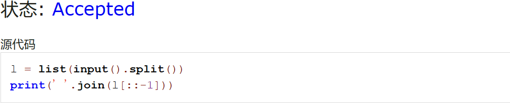
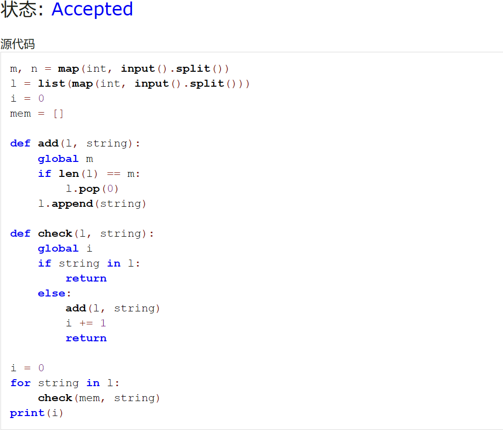
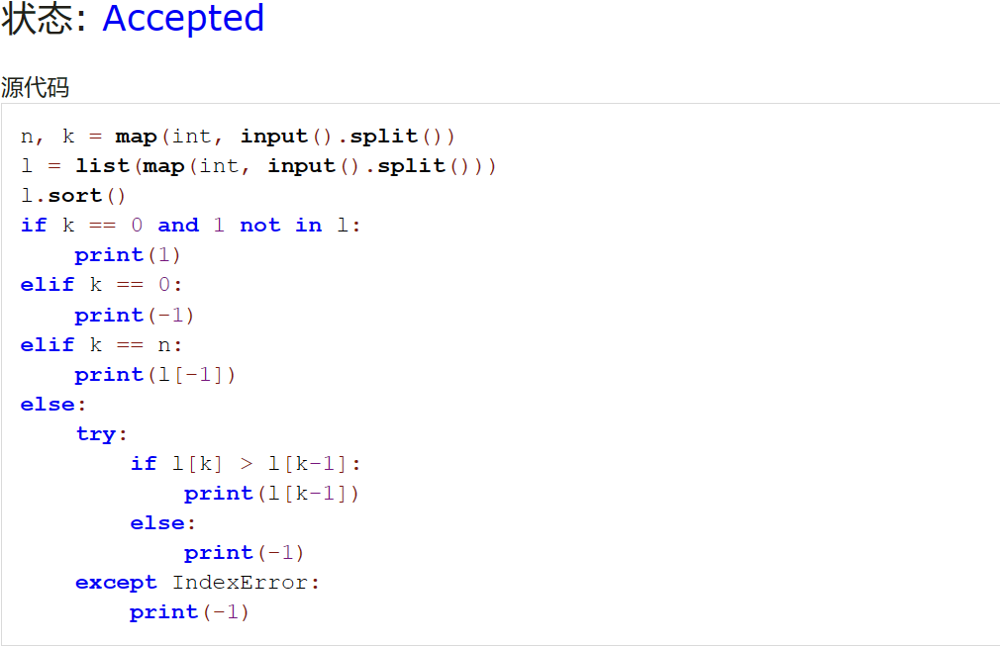
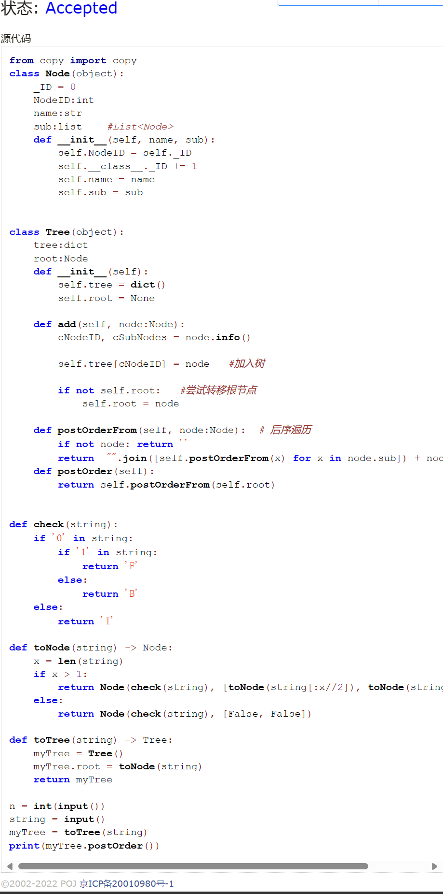
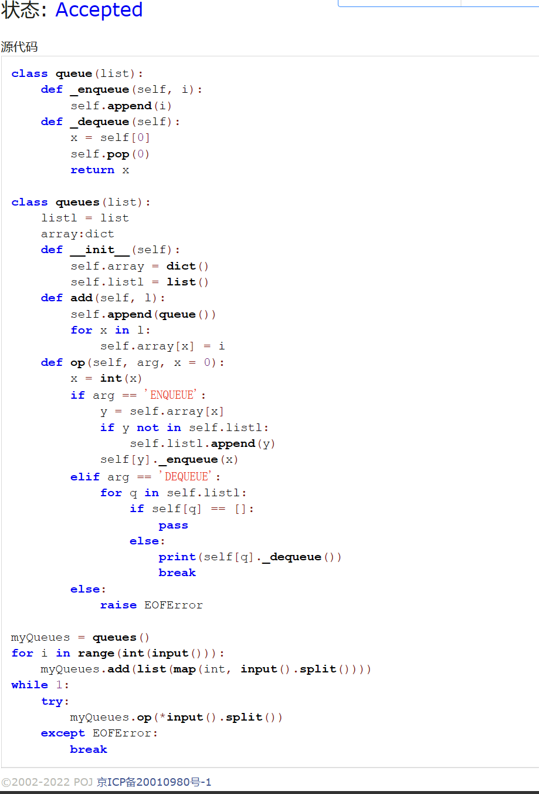
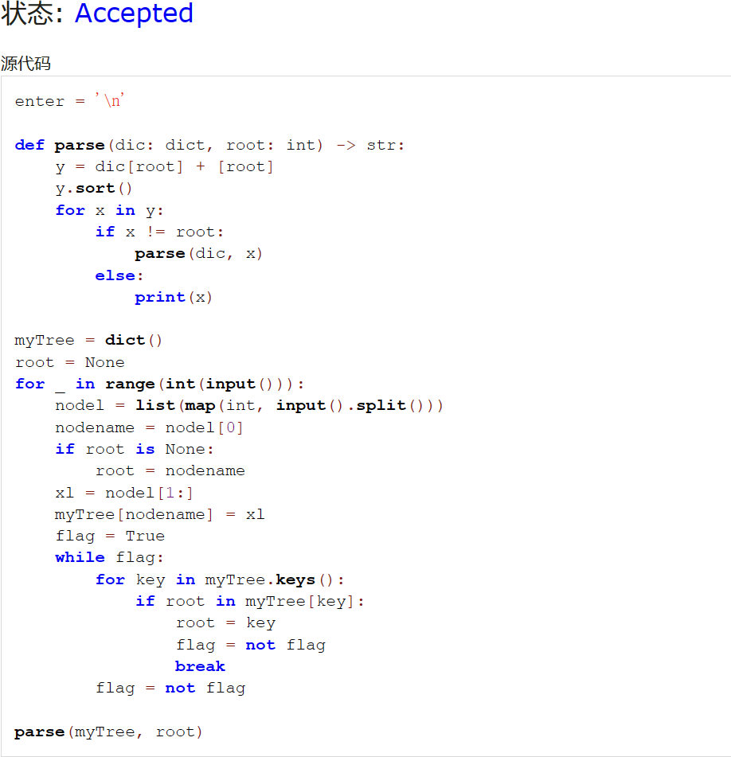

# Assignment #7: April 月考

Updated 1557 GMT+8 Apr 3, 2024

2024 spring, Complied by ~~天幂~~ 化学与分子工程学院


**说明：**

1）请把每个题目解题思路（可选），源码Python, 或者C++（已经在Codeforces/Openjudge上AC），截图（包含Accepted），填写到下面作业模版中（推荐使用 typora https://typoraio.cn ，或者用word）。AC 或者没有AC，都请标上每个题目大致花费时间。

2）提交时候先提交pdf文件，再把md或者doc文件上传到右侧“作业评论”。Canvas需要有同学清晰头像、提交文件有pdf、"作业评论"区有上传的md或者doc附件。

3）如果不能在截止前提交作业，请写明原因。


**编程环境**

操作系统：Windows 11 23H2

Python编程环境：Visual Studio Code 1.86.2230.


## 1. 题目

### 27706: 逐词倒放

http://cs101.openjudge.cn/practice/27706/


思路：使用[::-1]倒序遍历列表输出


代码

```python
l = list(input().split())
print(' '.join(l[::-1]))
```


代码运行截图 




### 27951: 机器翻译

http://cs101.openjudge.cn/practice/27951/


思路：根据题目描述进行模拟，比较直接。


代码

```python
m, n = map(int, input().split())
l = list(map(int, input().split()))
i = 0
mem = []

def add(l, string):
    global m
    if len(l) == m:
        l.pop(0)
    l.append(string)

def check(l, string):
    global i
    if string in l:
        return
    else:
        add(l, string)
        i += 1
        return

i = 0
for string in l:
    check(mem, string)
print(i)
```


代码运行截图 



### 27932: Less or Equal

http://cs101.openjudge.cn/practice/27932/


思路：主要麻烦在于边界情况。错了之后观察题目补全判断。


代码

```python
n, k = map(int, input().split())
l = list(map(int, input().split()))
l.sort()
if k == 0 and 1 not in l:
    print(1)
elif k == 0:
    print(-1)
elif k == n:
    print(l[-1])
else:
    try:
        if l[k] > l[k-1]:
            print(l[k-1])
        else:
            print(-1)
    except IndexError:
        print(-1)
```


代码运行截图 




### 27948: FBI树

http://cs101.openjudge.cn/practice/27948/


思路：根据题目描述模拟，传递字符串递归构造节点造树。


代码

```python
from copy import copy
class Node(object):
    _ID = 0
    NodeID:int
    name:str
    sub:list    #List<Node>
    def __init__(self, name, sub):
        self.NodeID = self._ID
        self.__class__._ID += 1
        self.name = name
        self.sub = sub
    

class Tree(object):
    tree:dict
    root:Node
    def __init__(self):
        self.tree = dict()
        self.root = None
    
    def add(self, node:Node):
        cNodeID, cSubNodes = node.info()
        
        self.tree[cNodeID] = node   #加入树
        
        if not self.root:   #尝试转移根节点
            self.root = node

    def postOrderFrom(self, node:Node):  # 后序遍历
        if not node: return ''
        return  "".join([self.postOrderFrom(x) for x in node.sub]) + node.name
    def postOrder(self):
        return self.postOrderFrom(self.root)
     
     
def check(string):
    if '0' in string:
        if '1' in string:
            return 'F'
        else:
            return 'B'
    else:
        return 'I'
           
def toNode(string) -> Node:
    x = len(string)
    if x > 1:
        return Node(check(string), [toNode(string[:x//2]), toNode(string[x//2:])])
    else:
        return Node(check(string), [False, False])

def toTree(string) -> Tree:
    myTree = Tree()
    myTree.root = toNode(string)
    return myTree

n = int(input())
string = input()
myTree = toTree(string)
print(myTree.postOrder())
```


代码运行截图 




### 27925: 小组队列

http://cs101.openjudge.cn/practice/27925/


思路：通过字典保存所在组，对组际与组内分别排序。转移根节点比较暴力。


代码

```python
class queue(list):
    def _enqueue(self, i):
        self.append(i)
    def _dequeue(self):
        x = self[0]
        self.pop(0)
        return x

class queues(list):
    listl = list
    array:dict
    def __init__(self):
        self.array = dict()
        self.listl = list()
    def add(self, l):
        self.append(queue())
        for x in l:
            self.array[x] = i
    def op(self, arg, x = 0):
        x = int(x)
        if arg == 'ENQUEUE':
            y = self.array[x]
            if y not in self.listl:
                self.listl.append(y)
            self[y]._enqueue(x)
        elif arg == 'DEQUEUE':
            for q in self.listl:
                if self[q] == []:
                    pass
                else:
                    print(self[q]._dequeue())
                    break
        else:
            raise EOFError

myQueues = queues()
for i in range(int(input())):
    myQueues.add(list(map(int, input().split())))
while 1:
    try:
        myQueues.op(*input().split())
    except EOFError:
        break
```


代码运行截图 




### 27928: 遍历树

http://cs101.openjudge.cn/practice/27928/


思路：一开始也看不咋懂题目，但是按照题目所给的要求写了一下，发现能过。


代码

```python
enter = '\n'

def parse(dic: dict, root: int) -> str:
    y = dic[root] + [root]
    y.sort()
    for x in y:
        if x != root:
            parse(dic, x)
        else:
            print(x)

myTree = dict()
root = None
for _ in range(int(input())):
    nodel = list(map(int, input().split()))
    nodename = nodel[0]
    if root is None:
        root = nodename
    xl = nodel[1:]
    myTree[nodename] = xl
    flag = True
    while flag:
        for key in myTree.keys():
            if root in myTree[key]:
                root = key
                flag = not flag
                break
        flag = not flag
        
parse(myTree, root)
```


代码运行截图 




## 2. 学习总结和收获

踩线勉强AC6了

唉 期中。忙着复习，暂时没时间学习，期中之后尽量补上。笔试题好难。


