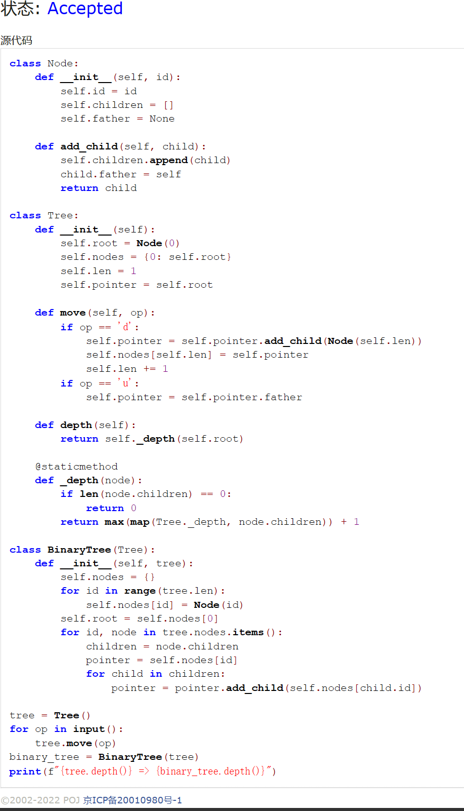
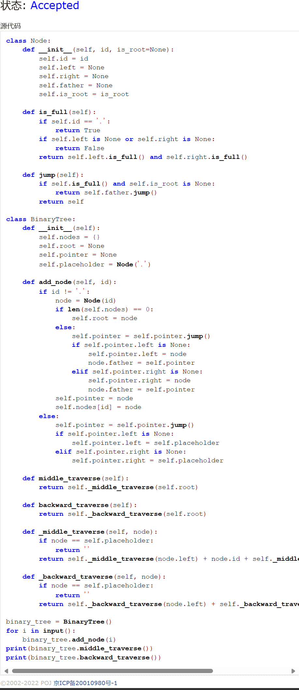
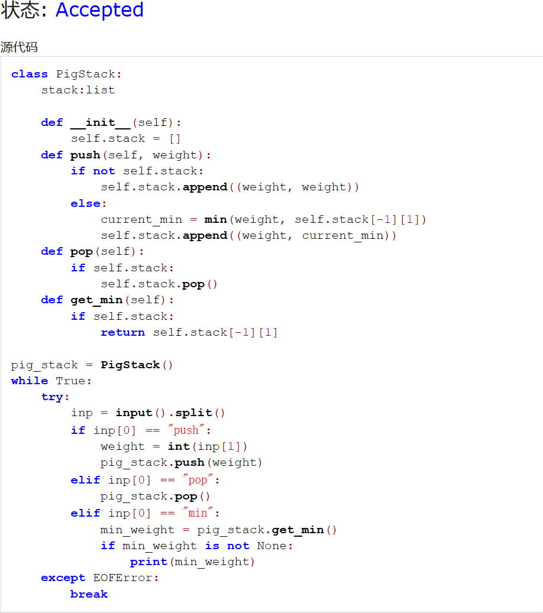
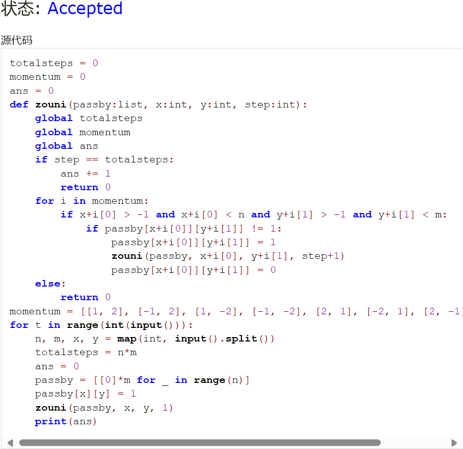
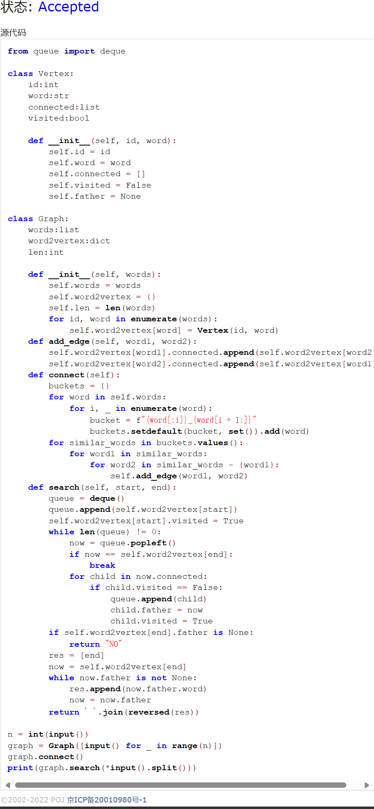
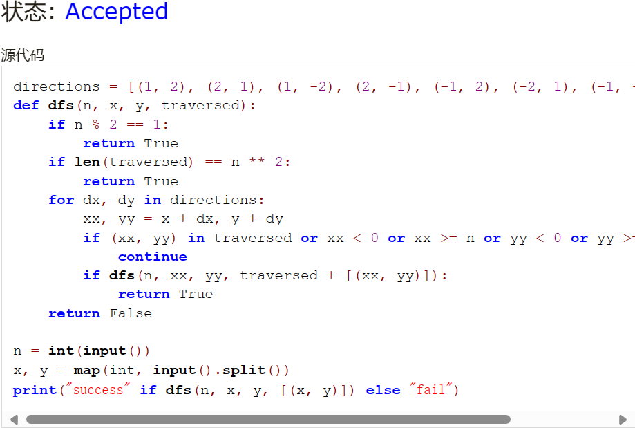

# Assignment #A: 图论：遍历，树算及栈

Updated 2018 GMT+8 Apr 21, 2024

2024 spring, Complied by ~~天幂~~ 化学与分子工程学院


**说明：**

1）请把每个题目解题思路（可选），源码Python, 或者C++（已经在Codeforces/Openjudge上AC），截图（包含Accepted），填写到下面作业模版中（推荐使用 typora https://typoraio.cn ，或者用word）。AC 或者没有AC，都请标上每个题目大致花费时间。

2）提交时候先提交pdf文件，再把md或者doc文件上传到右侧“作业评论”。Canvas需要有同学清晰头像、提交文件有pdf、"作业评论"区有上传的md或者doc附件。

3）如果不能在截止前提交作业，请写明原因。


**编程环境**

操作系统：Windows 11 23H2

Python编程环境：Visual Studio Code 1.86.2230.


## 1. 题目

### 20743: 整人的提词本

http://cs101.openjudge.cn/practice/20743/


思路：通过模拟翻转的过程，遇到右括号通过挨个弹出直至遇到左括号来翻转；遇到其他符号直接入栈。额外套了两层括号避免处理边界case。


代码

```python
class Node:
    def __init__(self, id):
        self.id = id
        self.children = []
        self.father = None
    
    def add_child(self, child):
        self.children.append(child)
        child.father = self
        return child

class Tree:
    def __init__(self):
        self.root = Node(0)
        self.nodes = {0: self.root}
        self.len = 1
        self.pointer = self.root

    def move(self, op):
        if op == 'd':
            self.pointer = self.pointer.add_child(Node(self.len))
            self.nodes[self.len] = self.pointer
            self.len += 1
        if op == 'u':
            self.pointer = self.pointer.father

    def depth(self):
        return self._depth(self.root)

    @staticmethod
    def _depth(node):
        if len(node.children) == 0:
            return 0
        return max(map(Tree._depth, node.children)) + 1

class BinaryTree(Tree):
    def __init__(self, tree):
        self.nodes = {}
        for id in range(tree.len):
            self.nodes[id] = Node(id)
        self.root = self.nodes[0]
        for id, node in tree.nodes.items():
            children = node.children
            pointer = self.nodes[id]
            for child in children:
                pointer = pointer.add_child(self.nodes[child.id])

tree = Tree()
for op in input():
    tree.move(op)
binary_tree = BinaryTree(tree)
print(f"{tree.depth()} => {binary_tree.depth()}")
```


代码运行截图




### 02255: 重建二叉树

http://cs101.openjudge.cn/practice/02255/


思路：复用`根据二叉树前中序序列建树`的代码，针对输入略作改动。


代码

```python
class Node:
    def __init__(self, id, is_root=None):
        self.id = id
        self.left = None
        self.right = None
        self.father = None
        self.is_root = is_root

    def is_full(self):
        if self.id == '.':
            return True
        if self.left is None or self.right is None:
            return False
        return self.left.is_full() and self.right.is_full()

    def jump(self):
        if self.is_full() and self.is_root is None:
            return self.father.jump()
        return self

class BinaryTree:
    def __init__(self):
        self.nodes = {}
        self.root = None
        self.pointer = None
        self.placeholder = Node('.')
    
    def add_node(self, id):
        if id != '.':
            node = Node(id)
            if len(self.nodes) == 0:
                self.root = node
            else:
                self.pointer = self.pointer.jump()
                if self.pointer.left is None:
                    self.pointer.left = node
                    node.father = self.pointer
                elif self.pointer.right is None:
                    self.pointer.right = node
                    node.father = self.pointer
            self.pointer = node
            self.nodes[id] = node
        else:
            self.pointer = self.pointer.jump()
            if self.pointer.left is None:
                self.pointer.left = self.placeholder
            elif self.pointer.right is None:
                self.pointer.right = self.placeholder

    def middle_traverse(self):
        return self._middle_traverse(self.root)

    def backward_traverse(self):
        return self._backward_traverse(self.root)

    def _middle_traverse(self, node):
        if node == self.placeholder:
            return ''
        return self._middle_traverse(node.left) + node.id + self._middle_traverse(node.right)

    def _backward_traverse(self, node):
        if node == self.placeholder:
            return ''
        return self._backward_traverse(node.left) + self._backward_traverse(node.right) + node.id

binary_tree = BinaryTree()
for i in input():
    binary_tree.add_node(i)
print(binary_tree.middle_traverse())
print(binary_tree.backward_traverse())
```


代码运行截图




### 01426: Find The Multiple

http://cs101.openjudge.cn/practice/01426/

要求用bfs实现


思路：后一层检查列表为遍历前一列表分别*10后+1或+0，以此构造bfs。


代码

```python
1
def bfs(x:int, l:list=[1]):
2
    for y in l:
3
        if y % x == 0:
4
            return y
5
    l2 = []
6
    for y in l:
7
        l2.append(10*y + 0)
8
        l2.append(10*y + 1)
9
    return bfs(x, l2)
10
​
11
while True:
12
    x = int(input())
13
    if x != 0:
14
        print(bfs(x))
15
    else:
16
        break
```





### 04115: 鸣人和佐助

bfs, http://cs101.openjudge.cn/practice/04115/


思路：比较暴力，存一下剩余的查克拉数目，避开曾在带有更多查克拉时已可经过的点。代码比较意识流，加了递归深度还是过了。


代码

```python
1
import sys
2
sys.setrecursionlimit(100000)
3
​
4
m, n, t = map(int, input().split())
5
l = [[-1] * n for _ in range(m)]
6
move_offset = [(0, -1), (0, 1), (-1, 0), (1, 0)]
7
pos1 = ()
8
pos2 = ()
9
ll = []
10
for y in range(m):
11
    temp = input()
12
    if '@' in temp:
13
        x = temp.index('@')
14
        pos1 = (x, y)
15
        l[y][x] = t
16
    if '+' in temp:
17
        x = temp.index('+')
18
        pos2 = (x, y)
19
    ll.append(temp)
20
​
21
def bfs(lx:list, steps:int = 0):
22
    global pos2, move_offset, ll, l, n, m
23
    if lx == []:
24
        return -1
25
    l2 = []
26
    for info in lx:
27
        pos, t = info
28
        if pos == pos2:
29
            return steps
30
        else:
31
            x, y = pos
32
            for offset in move_offset:
33
                i, j = offset
34
                xi, yj, tt = x + i, y + j, t
35
                if xi >= 0 and yj >= 0 and xi < n and yj < m:
36
                    if ll[yj][xi] == '#':
37
                        tt -= 1
38
                    if tt >= 0 and l[yj][xi] < tt:
39
                        l[yj][xi] = tt
40
                        l2.append(((xi, yj), tt))
41
    return bfs(l2, steps + 1)
42
​
43
print(bfs([(pos1, t)]))
```





### 20106: 走山路

Dijkstra, http://cs101.openjudge.cn/practice/20106/


思路：看了好久Dijkstra算法，才搞懂要怎么在题目里实现。维护一个与已经加入图的节点相邻的节点的前线heap，然后加入最近的节点并将其相邻节点heappush入表。这题和下一题的难点感觉都在于如何减枝（先加上权重还是先不加权重的问题），有了思路后一直在思考这个问题，看了一下群里发现有人写了一样思路的代码，就借鉴了一下大神的代码。


代码

```python
1
from heapq import *
2
​
3
move_offset = [(0, -1), (0, 1), (-1, 0), (1, 0)]
4
inf = float('inf')
5
m, n, p = map(int, input().split())
6
l = [list(map(lambda x: inf if x == '#' else int(x), input().split())) for _ in range(m)]
7
​
8
​
9
def bfs(x0, y0, xt, yt):
10
    global l, m, n, move_offset, inf
11
    distance = [[inf] * n for _ in range(m)]
12
    if l[y0][x0] == inf or l[yt][xt] == inf: return 'NO'
13
    distance[y0][x0] = 0
14
    front = [(0, x0, y0)]
15
    while front:
16
        d, x, y = heappop(front)
17
        if (x, y) == (xt, yt):
18
            return d
19
        h = l[y][x]
20
        for movement in move_offset:
21
            i, j = movement
22
            xn, yn = x + i, y + j
23
            if 0 <= xn < n and 0 <= yn < m and l[yn][xn] != inf:
24
                dn = abs(l[yn][xn] - h) + d
25
                if distance[yn][xn] > dn:
26
                    distance[yn][xn] = dn
27
                    heappush(front, (dn, xn, yn))
28
    return 'NO'
29
​
30
for _ in range(p):
31
    y0, x0, yt, xt = map(int, input().split())
32
    print(bfs(x0, y0, xt, yt))
```





### 05442: 兔子与星空

Prim, http://cs101.openjudge.cn/practice/05442/


思路：暴力枚举，每次加入距离图最近的一条边。


代码

```python
1
n = int(input())
2
dic = dict()
3
nodes = list()
4
ans = 0
5
for _ in range(n-1):
6
    raw = list(input().split())
7
    i = 0
8
    x = ''
9
    key = ''
10
    for char in raw:
11
        if i > 1:
12
            if i % 2 == 0:
13
                if char not in nodes:
14
                    nodes.append(char)
15
                key = x + char
16
            else:
17
                dic[key] = int(char)
18
        elif i == 1:
19
            pass
20
        elif i == 0:
21
            if char not in nodes:
22
                nodes.append(char)
23
            x = char
24
        i += 1
25
cnodes = []
26
cnodes.append(nodes.pop())
27
while True:
28
    mweight = 100
29
    medge = ''
30
    onode = ''
31
    monode = ''
32
    cweight = ''
33
    for edge in dic.keys():
34
        for cnode in cnodes:
35
            if cnode in edge:
36
                onode = edge.strip(cnode)
37
                if onode not in cnodes:
38
                    cweight = dic[edge]
39
                    if cweight < mweight:
40
                        medge = edge
41
                        mweight = cweight
42
                        monode = onode
43
    nodes.remove(monode)
44
    cnodes.append(monode)
45
    ans += mweight
46
    if not nodes:
47
        break
48
print(ans)
```





## 2. 学习总结和收获

感觉这周题目还是有一定难度的，尤其是bfs的剪枝问题。这块在期末复习时候需要关注一下。


