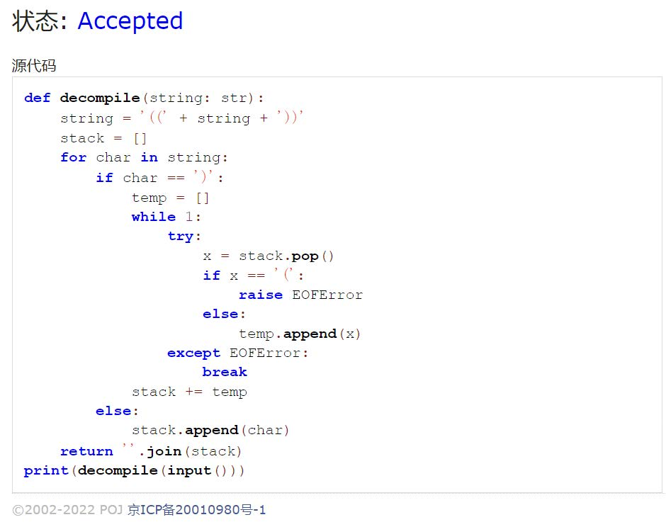

# Assignment #A: 图论：遍历，树算及栈

Updated 2018 GMT+8 Apr 21, 2024

2024 spring, Complied by ~~天幂~~ 化学与分子工程学院


**说明：**

1）请把每个题目解题思路（可选），源码Python, 或者C++（已经在Codeforces/Openjudge上AC），截图（包含Accepted），填写到下面作业模版中（推荐使用 typora https://typoraio.cn ，或者用word）。AC 或者没有AC，都请标上每个题目大致花费时间。

2）提交时候先提交pdf文件，再把md或者doc文件上传到右侧“作业评论”。Canvas需要有同学清晰头像、提交文件有pdf、"作业评论"区有上传的md或者doc附件。

3）如果不能在截止前提交作业，请写明原因。


**编程环境**

操作系统：Windows 11 23H2

Python编程环境：Visual Studio Code 1.86.2230.


## 1. 题目

### 20743: 整人的提词本

http://cs101.openjudge.cn/practice/20743/


思路：通过模拟翻转的过程，遇到右括号通过挨个弹出直至遇到左括号来翻转；遇到其他符号直接入栈。额外套了两层括号避免处理边界case。


代码

```python
def decompile(string: str):
    string = '((' + string + '))'
    stack = []
    for char in string:
        if char == ')':
            temp = []
            while 1:
                try:
                    x = stack.pop()
                    if x == '(':
                        raise EOFError
                    else:
                        temp.append(x)
                except EOFError:
                    break
            stack += temp
        else:
            stack.append(char)
    return ''.join(stack)
print(decompile(input()))
```


代码运行截图




### 02255: 重建二叉树

http://cs101.openjudge.cn/practice/02255/


思路：复用`根据二叉树前中序序列建树`的代码，针对输入略作改动。


代码

```python
class Node(object):
    _ID = 0
    NodeID:int
    pNodeID:int
    name:str
    sub:list    #List<Node>
    depth:int
    def __init__(self, name, l, pNodeID= -1, depth:int=0):
        self.NodeID = self._ID
        self.__class__._ID += 1
        self.pNodeID = pNodeID
        self.sub = []
        self.name = name
        self.depth = depth
        for node in l:
            self.sub.append(node)
    def info(self):
        return (self.NodeID, self.sub)

class Tree(object):
    tree:dict
    root:Node
    def __init__(self):
        self.tree = dict()
        self.root = None
    
    def add(self, node:Node):
        cNodeID, cSubNodes = node.info()
        
        self.tree[cNodeID] = node   #加入树
        
        if not self.root:   #尝试转移根节点
            self.root = node
        elif self.get(self.root.NodeID) in cSubNodes:
            self.root = node
            
        for nodes in self.tree.values():    #尝试添加父节点
            aNodeID, aSubNodes = nodes.info()
            if self.get(cNodeID) in aSubNodes:  #是子节点
                node.pNodeID = aNodeID
    def get(self, nodeID):
        if nodeID == -1:
            return False
        else:
            return self.tree[nodeID]
    def getDepth(self, node:Node):
        cSubNodes = node.sub
        if cSubNodes:
            if node.depth == 0:
                self.depth = 1 + max([self.getDepth(subNode) for subNode in cSubNodes])
            return node.depth
        return 0  
    def getTreeDep(self):   # This can also init the tree
        return self.getDepth(self.root)
    
    def levelOrderFrom(self, node:Node):
        if not node: return []
        
        res, queue = [], [node]
        while queue:
            level_node = []
            
            for _ in range(len(queue)):
                node = queue.pop(0)
                level_node.append(node.name)
                
                for x in node.sub:
                    if x:
                        queue.append(x)
            res.append(level_node)
            
        return "".join(["".join(x) for x in res])

    def levelOrder(self):
         return self.levelOrderFrom(self.root)
    def preOrderFrom(self, node:Node):  # 先序遍历
        if not node: return ''
        return node.name + "".join([self.preOrderFrom(x) for x in node.sub])
    def preOrder(self):
        return self.preOrderFrom(self.root)
    def postOrderFrom(self, node:Node):  # 后序遍历
        if not node: return ''
        return "".join([self.postOrderFrom(x) for x in node.sub]) + node.name
    def postOrder(self):
        return self.postOrderFrom(self.root)
     
           
def toTree(preOrPost: str, middle: str, index: int) -> Tree:
    def toNode(tree: Tree, middle: str, preOrPost: str, index: int):
        try:
            rootName = preOrPost[index]
            rootIndex = middle.find(rootName)
            info = middle[:rootIndex], middle[rootIndex + 1:], preOrPost[1:rootIndex + 1], preOrPost[rootIndex + 1:]
        except IndexError:
            return False
        if info == ('', '', '', ''):
            node = Node(rootName, [])
            tree.add(node)
            return(node)
        lSubTreeMiddle, rSubTreeMiddle, lSubTreePreOrPost, rSubTreePreOrPost = info
        node = Node(rootName, [toNode(tree, lSubTreeMiddle, lSubTreePreOrPost, index), toNode(tree, rSubTreeMiddle, rSubTreePreOrPost, index)])
        tree.add(node)
        return(node)
    myTree = Tree()
    toNode(myTree, middle, preOrPost, index)
    return myTree

while True:
    try:
        print(toTree(*input().split(), 0).postOrder())
    except EOFError:
        break
```


代码运行截图


### 01426: Find The Multiple

http://cs101.openjudge.cn/practice/01426/

要求用bfs实现


思路：后一层检查列表为遍历前一列表分别*10后+1或+0，以此构造bfs。


代码

```python
def bfs(x:int, l:list=[1]):
    for y in l:
        if y % x == 0:
            return y
    l2 = []
    for y in l:
        l2.append(10*y + 0)
        l2.append(10*y + 1)
    return bfs(x, l2)

while True:
    x = int(input())
    if x != 0:
        print(bfs(x))
    else:
        break
```


代码运行截图


### 04115: 鸣人和佐助

bfs, http://cs101.openjudge.cn/practice/04115/


思路：比较暴力，存一下剩余的查克拉数目，避开曾在带有更多查克拉时已可经过的点。代码比较意识流，加了递归深度还是过了。


代码

```python
import sys
sys.setrecursionlimit(100000)

m, n, t = map(int, input().split())
l = [[-1] * n for _ in range(m)]
move_offset = [(0, -1), (0, 1), (-1, 0), (1, 0)]
pos1 = ()
pos2 = ()
ll = []
for y in range(m):
    temp = input()
    if '@' in temp:
        x = temp.index('@')
        pos1 = (x, y)
        l[y][x] = t
    if '+' in temp:
        x = temp.index('+')
        pos2 = (x, y)
    ll.append(temp)

def bfs(lx:list, steps:int = 0):
    global pos2, move_offset, ll, l, n, m
    if lx == []:
        return -1
    l2 = []
    for info in lx:
        pos, t = info
        if pos == pos2:
            return steps
        else:
            x, y = pos
            for offset in move_offset:
                i, j = offset
                xi, yj, tt = x + i, y + j, t
                if xi >= 0 and yj >= 0 and xi < n and yj < m:
                    if ll[yj][xi] == '#':
                        tt -= 1
                    if tt >= 0 and l[yj][xi] < tt:
                        l[yj][xi] = tt
                        l2.append(((xi, yj), tt))
    return bfs(l2, steps + 1)

print(bfs([(pos1, t)]))
```


代码运行截图


### 20106: 走山路

Dijkstra, http://cs101.openjudge.cn/practice/20106/


思路：看了好久Dijkstra算法，才搞懂要怎么在题目里实现。维护一个与已经加入图的节点相邻的节点的前线heap，然后加入最近的节点并将其相邻节点heappush入表。这题和下一题的难点感觉都在于如何减枝（先加上权重还是先不加权重的问题），有了思路后一直在思考这个问题，看了一下群里发现有人写了一样思路的代码，就借鉴了一下大神的代码。


代码

```python
from heapq import *

move_offset = [(0, -1), (0, 1), (-1, 0), (1, 0)]
inf = float('inf')
m, n, p = map(int, input().split())
l = [list(map(lambda x: inf if x == '#' else int(x), input().split())) for _ in range(m)]


def bfs(x0, y0, xt, yt):
    global l, m, n, move_offset, inf
    distance = [[inf] * n for _ in range(m)]
    if l[y0][x0] == inf or l[yt][xt] == inf: return 'NO'
    distance[y0][x0] = 0
    front = [(0, x0, y0)]
    while front:
        d, x, y = heappop(front)
        if (x, y) == (xt, yt):
            return d
        h = l[y][x]
        for movement in move_offset:
            i, j = movement
            xn, yn = x + i, y + j
            if 0 <= xn < n and 0 <= yn < m and l[yn][xn] != inf:
                dn = abs(l[yn][xn] - h) + d
                if distance[yn][xn] > dn:
                    distance[yn][xn] = dn
                    heappush(front, (dn, xn, yn))
    return 'NO'

for _ in range(p):
    y0, x0, yt, xt = map(int, input().split())
    print(bfs(x0, y0, xt, yt))
```


代码运行截图


### 05442: 兔子与星空

Prim, http://cs101.openjudge.cn/practice/05442/


思路：暴力枚举，每次加入距离图最近的一条边。


代码

```python
n = int(input())
dic = dict()
nodes = list()
ans = 0
for _ in range(n-1):
    raw = list(input().split())
    i = 0
    x = ''
    key = ''
    for char in raw:
        if i > 1:
            if i % 2 == 0:
                if char not in nodes:
                    nodes.append(char)
                key = x + char
            else:
                dic[key] = int(char)
        elif i == 1:
            pass
        elif i == 0:
            if char not in nodes:
                nodes.append(char)
            x = char
        i += 1
cnodes = []
cnodes.append(nodes.pop())
while True:
    mweight = 100
    medge = ''
    onode = ''
    monode = ''
    cweight = ''
    for edge in dic.keys():
        for cnode in cnodes:
            if cnode in edge:
                onode = edge.strip(cnode)
                if onode not in cnodes:
                    cweight = dic[edge]
                    if cweight < mweight:
                        medge = edge
                        mweight = cweight
                        monode = onode
    nodes.remove(monode)
    cnodes.append(monode)
    ans += mweight
    if not nodes:
        break
print(ans)
```


代码运行截图


## 2. 学习总结和收获

感觉这周题目还是有一定难度的，尤其是bfs的剪枝问题。这块在期末复习时候需要关注一下。


